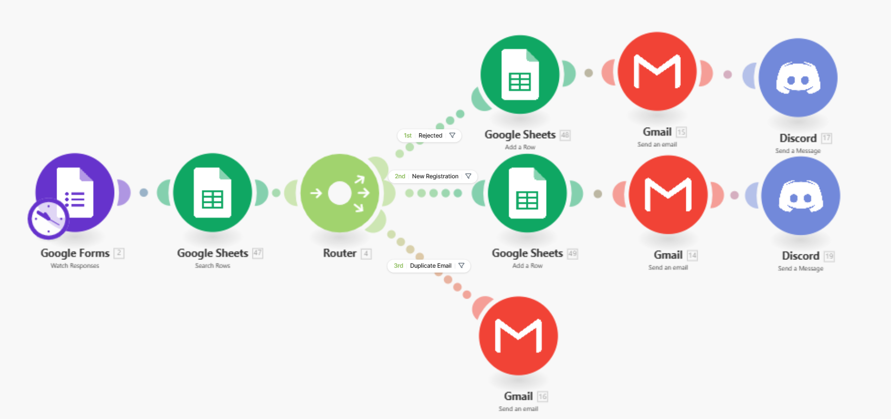
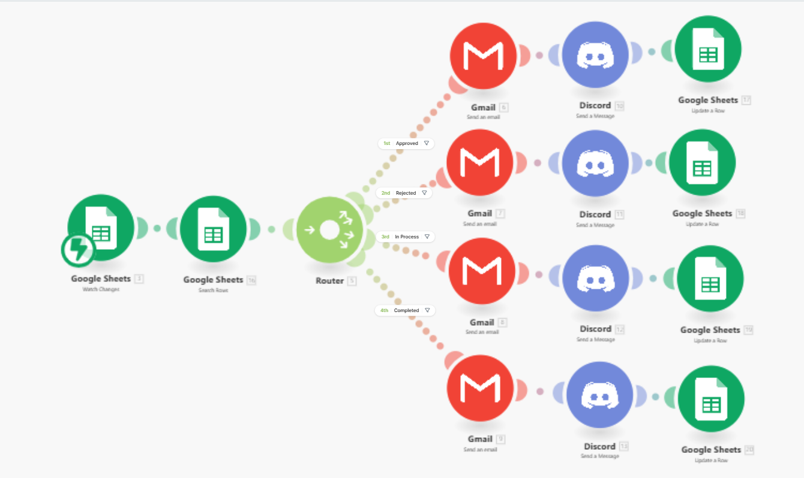
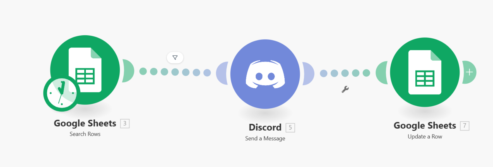

# Client-Request-Management-Automation
A self-built project simulating a freelancing and automation agency workflow.

## Overview
This project automates client intake, status tracking, and follow-ups
using Make.com with Google Forms, Google Sheets, Email, and Discord.

## Tools Used
- Make.com
- Google Forms
- Google Sheets
- Gmail
- Discord Webhooks

## Scenarios Implemented
1. Client Intake & Auto Rejection
2. Status Update Tracking
3. Reminder Automation (24-hour follow-up)

## Sheet Structure
- Contact Date
- Client Name
- Email
- Service Required
- Project Description
- Budget
- Deadline
- Status
- Last Status Update
- Reminder Sent
- Comments

## Business Value
- Reduces manual follow-ups
- Prevents missed leads
- Improves response time

## 📸 Automation Scenarios Preview
### Scenario 1: Client Submission & Initial Handling

### Scenario 2: Status Change Automation

### Scenario 3: Reminder Automation

